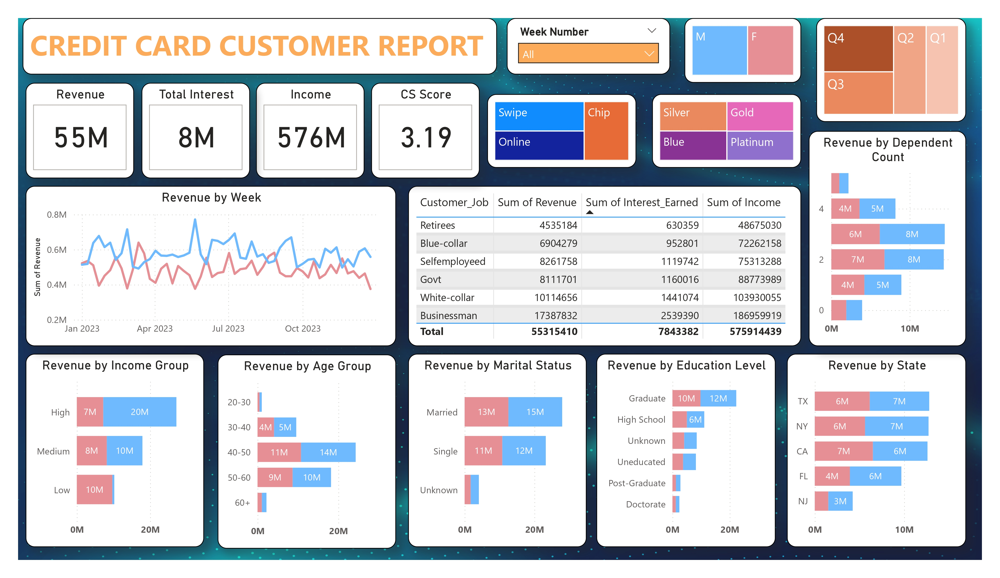
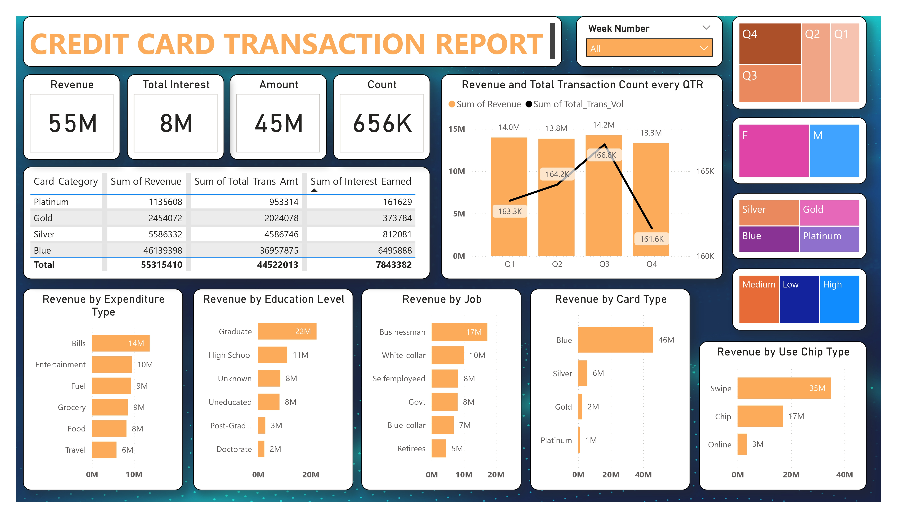

# CREDIT CARD DASHBOARD - Power BI

## 📊 OVERVIEW

- This Power BI project provides a comprehensive analysis of __credit card customer behaviour__ and __transaction patterns__ using interactive dashboards.
  It is designed to help stakeholders make data driven decisions by visualizing revenuue, transaction types, demographics and more.
---
## 🚀 OBJECTIVES

- Analyze revenue and interest from different customer segments.
- Visualize credit card usage by card type, chip type, gender, and location.
- Identify trends in customer spending and income distribution.
- Understand demographic impact on credit card usage (age, marital status, job, education).
- Track revenue and transaction counts across quarters.

---
## 📸 DASHBOARD PREVIEWS

### 🧍‍♂️ Customer Analysis Dashboard

### 💳 Transaction Analysis Dashboard

---
## 📁 DASHBOARD FILES

- `Credit_Card_Customer_Report.pbix` – Insights on customer demographics and revenue
- `Credit_Card_Transaction_Report.pbix` – Deep dive into transaction-level metrics

---
## 📌KEY INSIGHTS

### 1. **Customer Insights**
- **Revenue**: ₹55M from credit card customers
- **Top Job Segments**: Businessmen and White-collar professionals contribute the most revenue
- **Age Group**: Highest revenue from customers aged 40-50
- **Card Preference**: Blue card users generate the most revenue

### 2. **Transaction Insights**
- **Total Transactions**: 656K transactions totaling ₹45M
- **Most Used Card Type**: Blue
- **Preferred Usage Mode**: Swipe (₹35M), followed by Chip (₹17M)
- **Top Expense Category**: Bills followed by Entertainment and Fuel
        
---
## 🧰 TOOLS USED

- Microsoft Power BI
- DAX for custom calculations
- GitHub for version control

---
## 📎 HOW TO VIEW

1. Clone or download the repo
2. Open `.pbix` files in Power BI Desktop

---
## 📞 CONTACT

For any queries or suggestions, feel free to reach out at [alaskarawatar@gmail.com]
